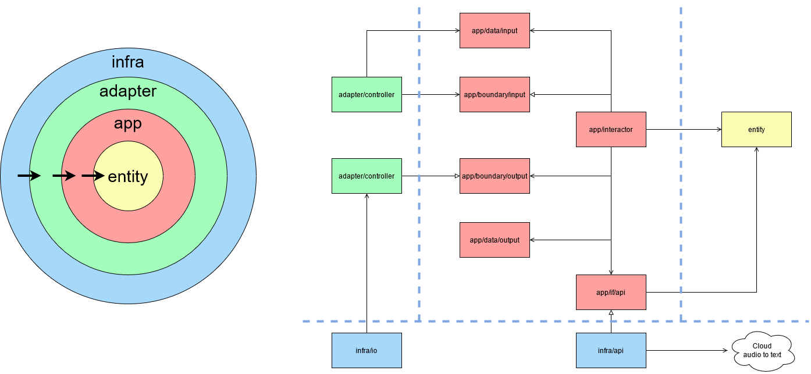

# audio2text

## 概要

音声ファイルからテキストへ変換のコマンドラインツール。

音声ファイルを[GoogleのSpeech-to-text](https://cloud.google.com/speech-to-text/?hl=ja)を使いテキストへ変換。  
変換後テキストから、指定単語とその前後5単語を抽出してコンソールへ出力する。  
その際指定単語の出現順番、開始時間、終了時間も表示する。

## Install

### 環境

以下で動作確認

- go: 1.16.5
- OS:
    - Mac: 10.15.7
    - Ubuntu: wsl2, 20.04.2 LTS

### バイナリコマンドのビルド

※ `go run` で実行する事も可能

```
cd audio2text/
go get ./...
go build ./cmd/audio2text
chown +x audio2text
```

### Google Cloudの設定

1. プロジェクトを作成するか既存のものを選択
1. プロジェクトに対してSpeech-to-Text APIを有効にする
1. サービスアカウントを作成
1. JSONでサービスアカウントキーをダウンロードする
1. 環境変数`GOOGLE_APPLICATION_CREDENTIALS`をサービスアカウントキーが含まれるJSONファイルのパスに設定する


参考: https://cloud.google.com/speech-to-text/docs/quickstart-gcloud?hl=ja

### オーディオファイルの準備

https://github.com/IBM/speech-to-text-code-pattern/tree/master/public/audio

からja-JPの音声ファイルをダウンロードしておく

## 実行方法

以下のように実行(バイナリ実行は`go run ./cmd/audio2text` でも可)

```sh
audio2text -f ./public_audio_ja-JP_Narrowband-sample.wav -k '住所,連絡,契約,本人,17',一部 [-sr 16000]
```
実行例 
```sh
$ audio2text -f ./samples/audio/public_audio_ja-JP_Narrowband-sample.wav -k '住所,連絡,契約,本人,17' -sr 8000
[pos: 2, start: 300ms, end: 600ms, keyword: 住所] ご 住所 の 変更 で ござい ます
[pos: 10, start: 2.5s, end: 2.6s, keyword: 連絡] で ござい ます ね ご 連絡 ありがとう ござい ます 恐れ入り ます
[pos: 18, start: 5.7s, end: 5.8s, keyword: 契約] ます 恐れ入り ます が ご 契約 内容 を 確認 いたし ます
[pos: 33, start: 9.4s, end: 10.1s, keyword: 契約] を 頂い てる 方 は 契約 者 ご 本人 様 で
[pos: 36, start: 10.3s, end: 10.4s, keyword: 本人] 方 は 契約 者 ご 本人 様 で いらっしゃい ます か
[pos: 45, start: 13.3s, end: 13.9s, keyword: 本人] ます か はい そう です 本人 です それ で は お
[pos: 85, start: 26.2s, end: 27s, keyword: 契約] いらっしゃい ます ね で は 契約 者 ご 本人 様 確認
[pos: 88, start: 27.3s, end: 27.3s, keyword: 本人] で は 契約 者 ご 本人 様 確認 の ため 恐れ入り
[pos: 112, start: 38.4s, end: 38.8s, keyword: 17] が 1937 年 6 月 17 日 です
```

コンソール上では、指定単語は赤色で表示される。

### オプション

- `-f`: 音声ファイルへのパスを設定。**1分**以下のファイルのみ変換可能
- `-k`: 検索するキーワードを指定。半角カンマ区切りで複数語の指定可能
- `-sr`: 音声のサンプルレート(Hz)を指定。正しく変換するには適切な指定が必要。以下参考までに
    - [ja-JP_Broadband-sample.wav](https://github.com/IBM/speech-to-text-code-pattern/blob/master/public/audio/ja-JP_Broadband-sample.wav) = 16000
    - [public_audio_ja-JP_Narrowband-sample.wav](https://github.com/IBM/speech-to-text-code-pattern/blob/master/public/audio/nl-NL_Narrowband-sample.wav) =  8000

- 環境変数`DEBUG`に`true`を指定すると、デバッグログを出力する

## 構成

クリーンアーキテクチャ構成。  
ViewModelは省いたが、概ね基本に沿った作り


### テスト

細かい部分のUnitTestと、全体main.goに対してざっくりと動作確認するためのテストを作成  
実行コマンドは以下
```
[DEBUG=true] go test ./... [-v]
```

## TODO

- オーディオファイルの判定
    - サンプルレートの判定
- 1分以上のファイルでの利用 
    - Speech-to-textで非同期のアップロード->変換のapiがある
- バイナリサイズの削減U
    - [UPX](https://en.wikipedia.org/wiki/UPX)とかかなり圧縮されるらしい
- Usage追加
- PresenterとFormatterの分離
- テスト追加
